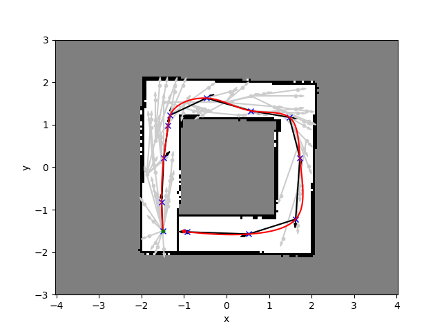
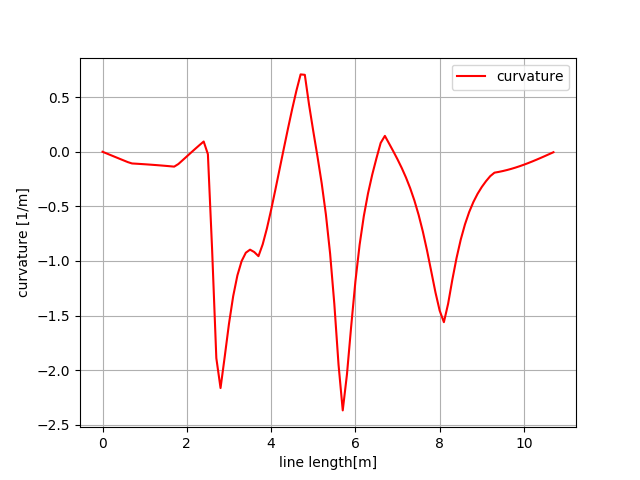

# Robot Racing


To run gazebo:
```
roslaunch ~/catkin_ws/src/exercises/robot-racing/launch/gazebo_uturn.launch 
```

Possibly needed:

```
export GAZEBO_MODEL_PATH=~/catkin_ws/src/exercises/robot-racing/models/
```

## RRT*




