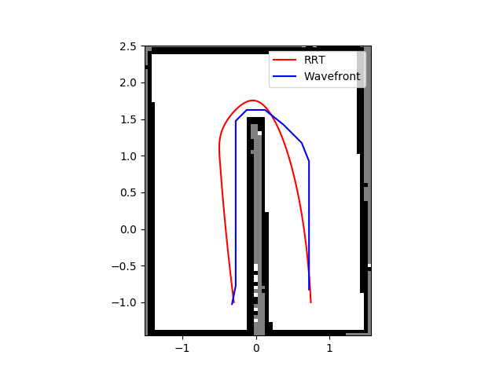
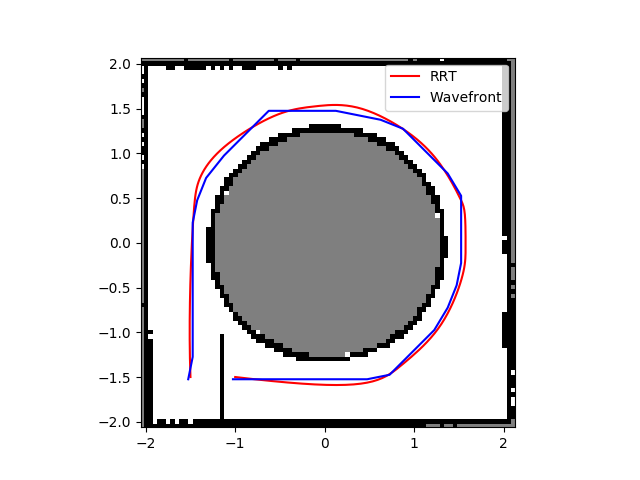
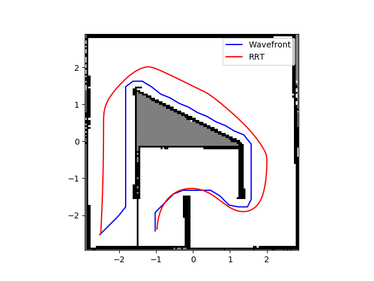
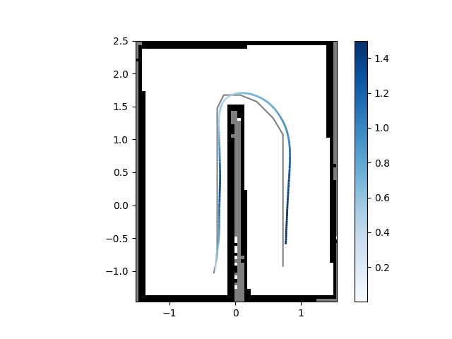
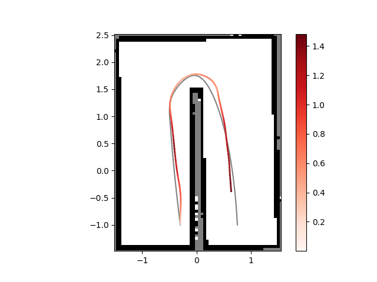
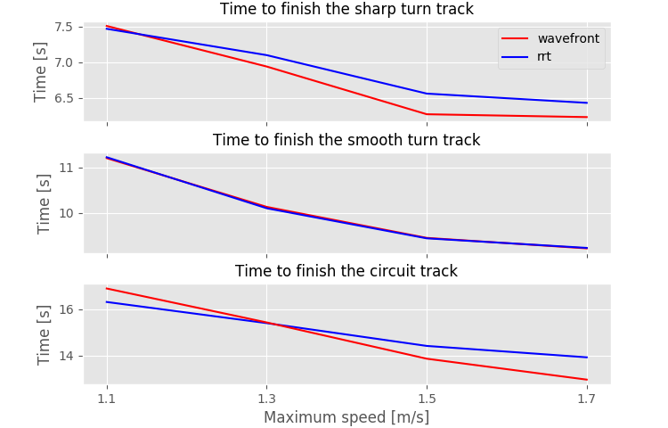
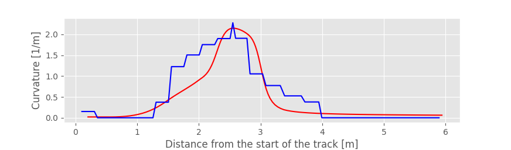
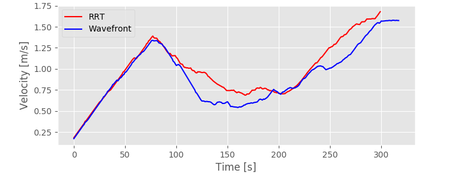
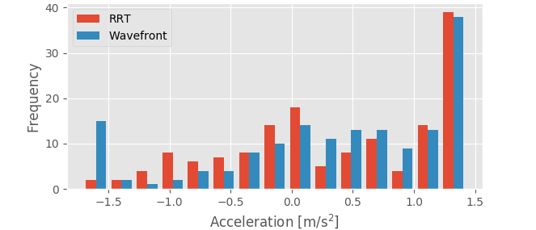

# Robot Racing


To run gazebo (choose tack out of gazebo_sharp_turn, gazebo_smooth_turn, gazebo_circuit):
```
roslaunch exercises gazebo_sharp_turn.launch 
```

Possibly needed:

```
cd ~/catkin_ws/
catkim_make
export GAZEBO_MODEL_PATH=~/catkin_ws/src/exercises/robot-racing/models/
```

## Path planning







## Steering control
Planned Wavefront path in grey, actual path in blue (colormap indicates velocity)


Planned RRT* path in grey, actual path in blue (colormap indicates velocity)


## Results


Plots of curvatures, velocities and histogram of accelerations on the sharp turn track



